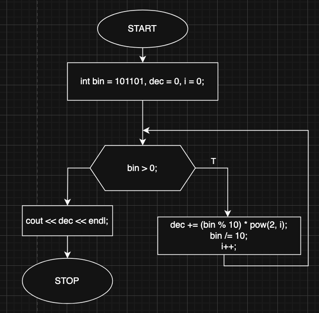

# bin2dec

Implementation of binary to decimal conversion algorithm using Positional Notation Method.

Rightmost digit is called 'Less Significant Bit' (LSB) is algorithm's starting point. Program starts by multiplying bit value by 2 to the power of digit position.
In case of LSB 2^0, until it reaches 'Most Significant Bit' (MSB), which has a weight of 2^(n-1). Sum of all obtained values is the digital representation of the binary.

## Block diagram

