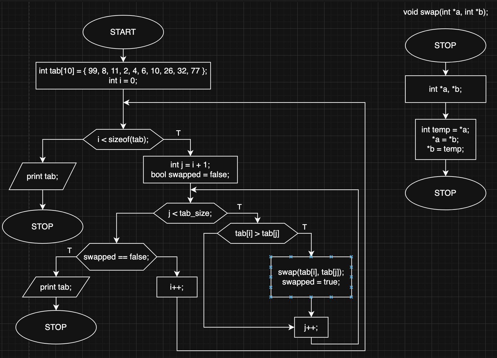

# bubble_sort

Implementation of bubble sort algorithm.

Bubble sort is a sorting algorithm, that interates throught every element of the table, compares adjacent elements and swaps them if value of first element is greater than seconds.
I've made one optimalization, which is swapped variable that determinates if any value has been swapped during latest iteration, if not this means that the table has already been sorted.

**Time complexity:** O(n^2)
**Space complexity:** O(1)

## Block diagram

