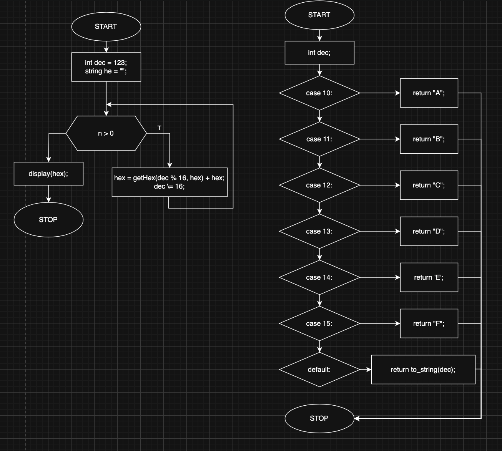

# Decimal to Hexadecimal Converter (dec2hex)

## Overview

This project implements an algorithm to convert a **decimal number** into its **hexadecimal representation** (base 16).

## How It Works

1. **Divide** the decimal number by **16**.
2. **Store the remainder**, which represents the next hexadecimal digit.
3. **Repeat** the process with the quotient until it becomes **zero**.
4. **Read the remainders in reverse order** to obtain the final hexadecimal value.

## Block diagram

