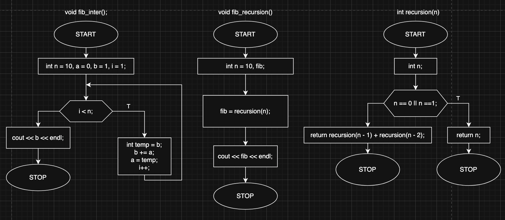

# Fibonacci Sequence

## Overview

This project implements two different approaches to calculate Fibonacci sequence elements:  
1. **Iterative Method** (using a loop)  
2. **Recursive Method** (using function calls)

## What is the Fibonacci Sequence?
The Fibonacci sequence is a series of numbers where each number is the sum of the two preceding ones:  

## Block diagram

