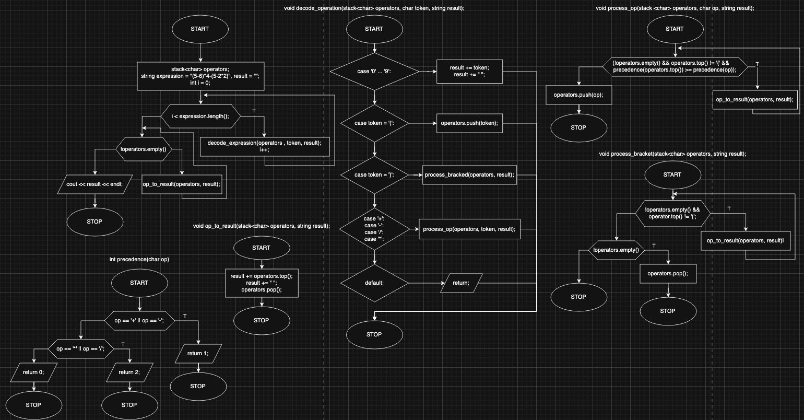

# Infix to Reverse Polish Notation (RPN) Converter

## Overview

This project implements an algorithm to convert infix mathematical expressions into **Reverse Polish Notation (RPN)**.

### What is Reverse Polish Notation (RPN)?
Reverse Polish Notation is a mathematical notation in which operators follow their operands. This notation eliminates the need for parentheses, making it more efficient for evaluation by computers and calculators.

## How It Works

The `infix_to_rpn` algorithm processes an infix expression by iterating through each element and using a stack to correctly position operators in the RPN expression.

### Conversion Rules:
1. **Numbers** → Append directly to the RPN expression.
2. **Opening Parenthesis `(`** → Push onto the stack.
3. **Closing Parenthesis `)`** → Pop operators from the stack and append them to the RPN expression until an opening parenthesis is encountered (which is then discarded).
4. **Operators (`+`, `-`, `*`, `/`, etc.)** →  
   - While the operator on top of the stack has **greater or equal precedence**, pop it and append it to the RPN expression.
   - Then, push the current operator onto the stack.

## Block diagram

