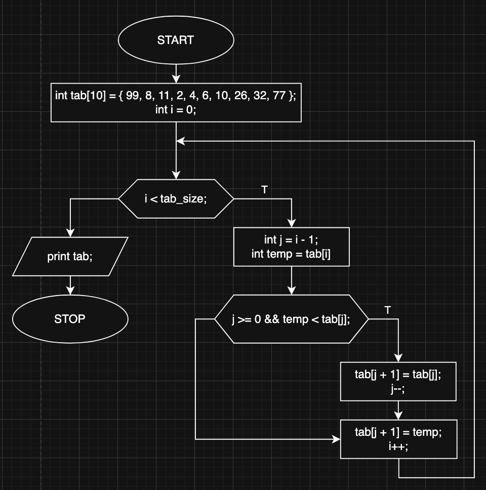

# Insertion Sort Algorithm

## Overview

This project implements the **Insertion Sort** algorithm, a simple sorting technique that builds the sorted array one element at a time.

## How It Works

1. Start with the second element (since a single-element list is already sorted).
2. Compare it with the previous elements and **shift** them right if they are greater.
3. Insert the element into its correct position.
4. Repeat for all elements until the array is fully sorted.

**Time complexity:** O(n^2)
**Space complexity:** O(1)

## Block diagram

