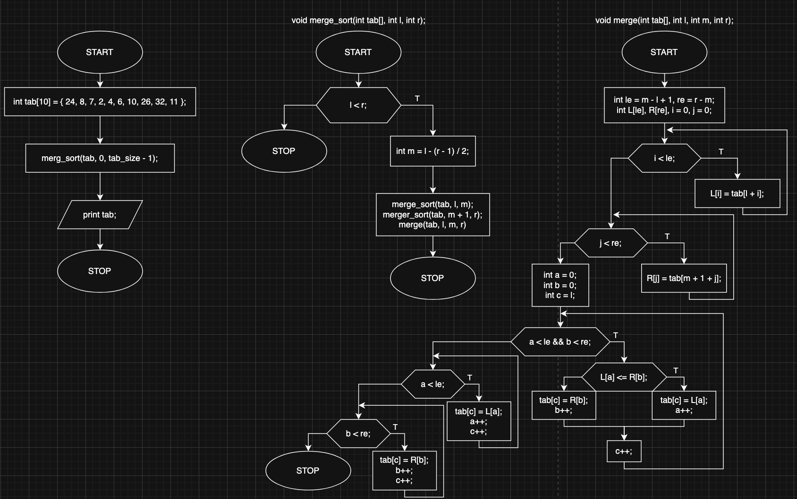

# Merge Sort Algorithm

## Overview

This project implements the **Merge Sort** algorithm, a **divide-and-conquer** sorting technique that recursively splits an array into smaller parts and merges them in sorted order.

## How It Works

1. **Divide**: Split the array into two equal halves recursively until each sub-array contains only one element.
2. **Conquer**: Recursively sort each half.
3. **Merge**: Combine the sorted halves into a single sorted array.

**Time complexity:** O(n*log n)

**Space complexity:** O(n)

## Block diagram

