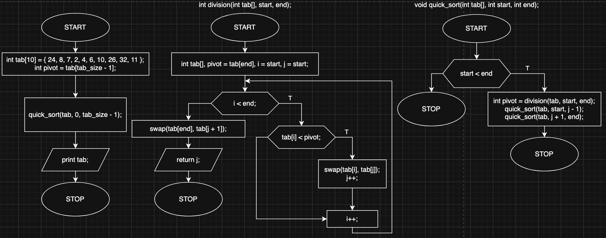

# quick_sort

Implementation of the quick sort alogrithm.

Quick sort algorithm works by choosing the pivot point and then sorts given table based on the choose pivot. It places elements of the grater value than pivot point on the right and elements of the lower value on the left.

Algorithm splits and sorts the given table recursively untill the talbe has less than two elements. It's time and space complexity depends on a given scenario, paradoxicaly algorithm does not handle sorted table pretty well.

Algorithm can be optimalized by changing a way of how the pivot is chossen. Most standard way to chosse the pivot is first or last position in the table that is being sorted (like in this implementation).
Choosing a random pivot or a median of three random elements.

**Time complexity:** best case scenario O(n log(n)), worst case scenario O(n^2)

**Space complexity:** best case scenrio O(n), worst case scenario O(log(n))

## Block diagram

