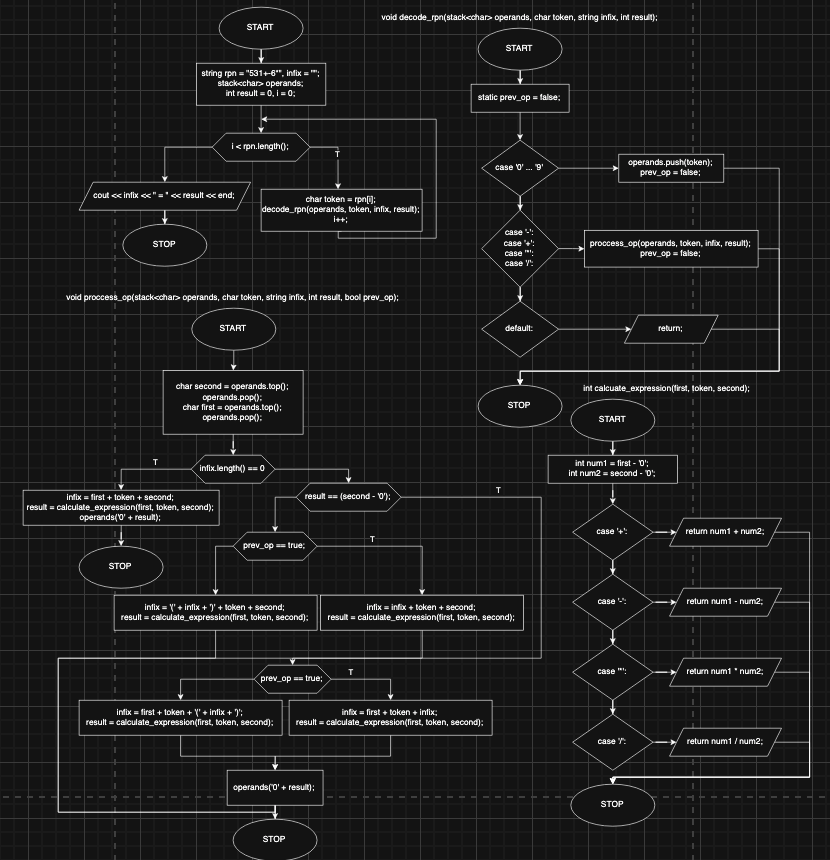

# Reverse Polish Notation (RPN) to Infix Conversion

## Overview

This project implements a **Reverse Polish Notation (RPN) to Infix Expression Converter** that processes a given RPN expression and converts it to an infix expression with parentheses while calculating the result.

## How It Works

1. **Process RPN tokens**: Each token is processed one by one from the input RPN string.
2. **Operands and operators**: When an operand (a number) is encountered, it is pushed onto the operand stack. When an operator is encountered, the algorithm pops two operands from the stack, applies the operator, and then pushes the result back onto the stack.
3. **Construct Infix Expression**: The algorithm constructs an infix expression by adding operators and operands along with appropriate parentheses to maintain the correct order of operations.
4. **Calculate the result**: The algorithm calculates the result of the expression as it processes the RPN input.

### Conversion Process
- When encountering an operand (number): Push it onto the operand stack.
- When encountering an operator:
  1. Pop the top two operands from the stack.
  2. Perform the operation.
  3. Build the corresponding infix expression based on whether previous operations were done with a higher or equal precedence.
  4. Push the result back onto the operand stack.

## Block diagram

