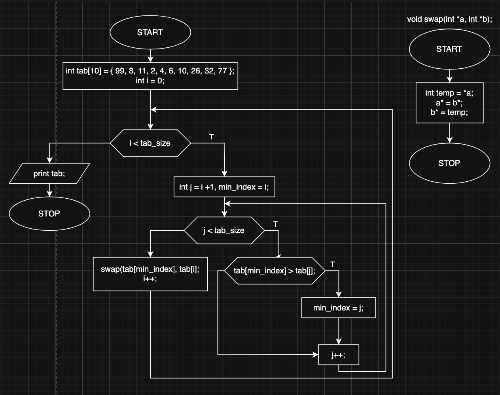

# selection_sort

Implementation of selection sort algorithm.

Selection sort looks for the index of the element with the smallest or the largest value (smallest in this implementation) and then swaps found element with the "i" index.

Time complexity: O(n^2)
Space complexity: O(1)

## Block diagram

